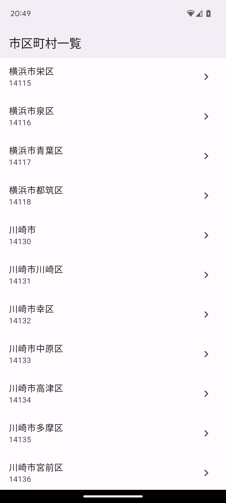

# Flutter RESAS API hands-on

内閣府地方創生推進室が提供する、地域経済分析システムの [RESAS（リーサス）](https://resas.go.jp/#/13/13101) APIを利用したFlutterハンズオン用のレポジトリです。本レポジトリは、[【初学者向け】Flutter×RESAS APIで学ぶ、はじめてのスマホアプリ開発](https://zenn.dev/tsuruo/books/flutter-resas-app-hands-on) のソースコードであり、`step_01`から`step_09`まで各章と対応しています。

## スクリーンショット

| 一覧画面 | 詳細画面 |
| --- | --- |
| 市区町村一覧 | 一人あたりの地方税 |
|  |  |

## 事前準備

プロジェクトルートに以下を記載した`env.dart`ファイルを作成してください。
このAPIキーは今回はアプリに含めてますが、実際には要件に応じてサーバーサイドに隠蔽することも検討してください。

```dart
abstract class Env {
  static const resasApiKey = '[YOUR_API_KEY]';
}

```

## 参考

- [ポケモンから学ぶFlutter](https://zenn.dev/sugitlab/books/flutter_poke_app_handson)
