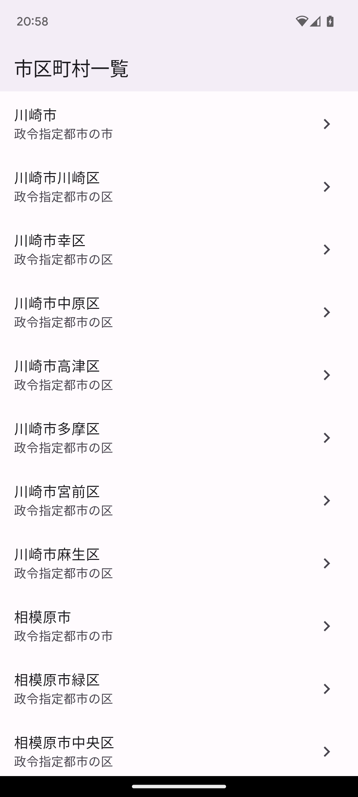
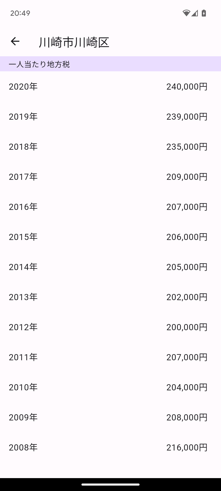

# Flutter RESAS API hands-on

内閣府地方創生推進室が提供する、地域経済分析システムの [RESAS（リーサス）](https://resas.go.jp/#/13/13101) APIを利用したFlutterハンズオン用のレポジトリです。

## スクリーンショット

| 一覧画面 | 詳細画面 |
| --- | --- |
| 市区町村一覧 | 一人あたりの地方税 |
|  |  |

## 事前準備

プロジェクトルートに以下を記載した`env.dart`ファイルを作成してください。
本来このAPIキーは漏洩してはいけない情報のためサーバ経由でアクセスした方がベターですが、今回は簡略化のため割愛しています。

```dart
abstract class Env {
  static const resasApiKey = '[YOUR_API_KEY]';
}

```

## チャプター（仮）

1. Widgetを使った画面レイアウトの作成
1. Navigator APIを使った画面遷移
1. モデルの作成
1. APIを叩いて非同期のデータ取得
1. `FutureBuilder`を使って非同期で取得したデータを表示

## 参考

- [ポケモンから学ぶFlutter](https://zenn.dev/sugitlab/books/flutter_poke_app_handson)
